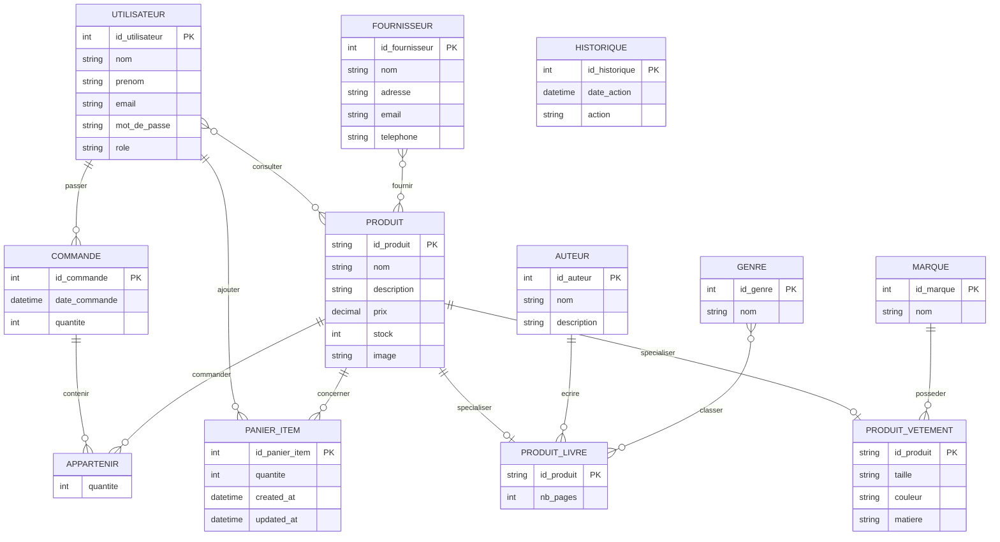

# MCD - Gestion produits

Le fichier Looping du MCD est :

```text
gestion-produits-mvc/bdd/mcd_gestion_produits.loo
```

Il est a ouvrir avec l'application Looping.

Le MCD est base sur la base SQL Server `gestion_produits`.
Les tables techniques `migrations` et `sysdiagrams` ne sont pas retenues dans le MCD, car elles ne representent pas le metier de l'application.

Note : le fichier Looping `.loo` reprend le MCD principal de la base. La table SQL `panier_item`, ajoutee pour le panier, est documentee ci-dessous dans l'association `ajouter_au_panier`.

## Entites

### Utilisateur

- id_utilisateur
- nom
- prenom
- email
- mot_de_passe
- role

### Produit

- id_produit
- nom
- description
- prix
- stock
- image

### Commande

- id_commande
- date_commande
- quantite

### Auteur

- id_auteur
- nom
- description

### Genre

- id_genre
- nom

### Fournisseur

- id_fournisseur
- nom
- adresse
- email
- telephone

### Marque

- id_marque
- nom

### Produit livre

- nb_pages

Cette entite est une specialisation de `Produit`.

### Produit vetement

- taille
- couleur
- matiere

Cette entite est une specialisation de `Produit`.

### Historique

- id_historique
- date_action
- action

## Associations et cardinalites

| Association | Entite 1 | Cardinalite | Entite 2 | Cardinalite | Attributs |
| --- | --- | --- | --- | --- | --- |
| passer | Utilisateur | 0,N | Commande | 1,1 | Aucun |
| appartenir | Commande | 0,N | Produit | 0,N | quantite |
| consulter | Utilisateur | 0,N | Produit | 0,N | Aucun |
| fournir | Fournisseur | 0,N | Produit | 0,N | Aucun |
| avoir_auteur | Auteur | 0,N | Produit livre | 0,1 | Aucun |
| classer | Genre | 0,N | Produit livre | 0,N | Aucun |
| posseder_marque | Marque | 0,N | Produit vetement | 0,1 | Aucun |
| ajouter_au_panier | Utilisateur | 0,N | Produit | 0,N | quantite, created_at, updated_at |

## Schema visuel


